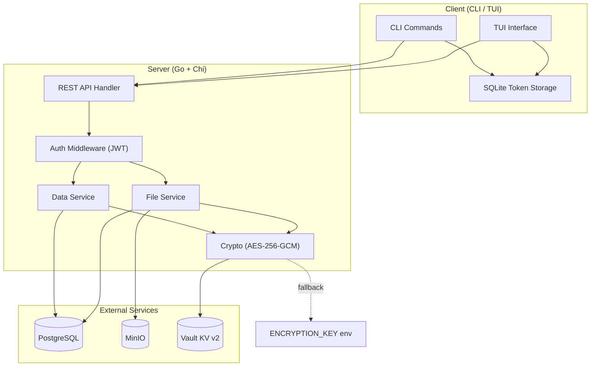
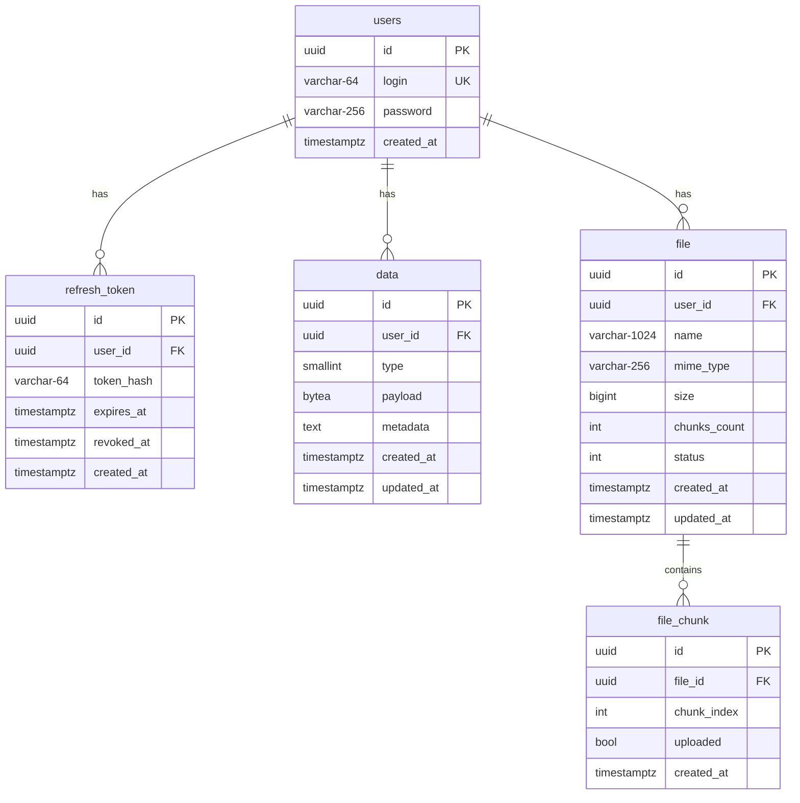
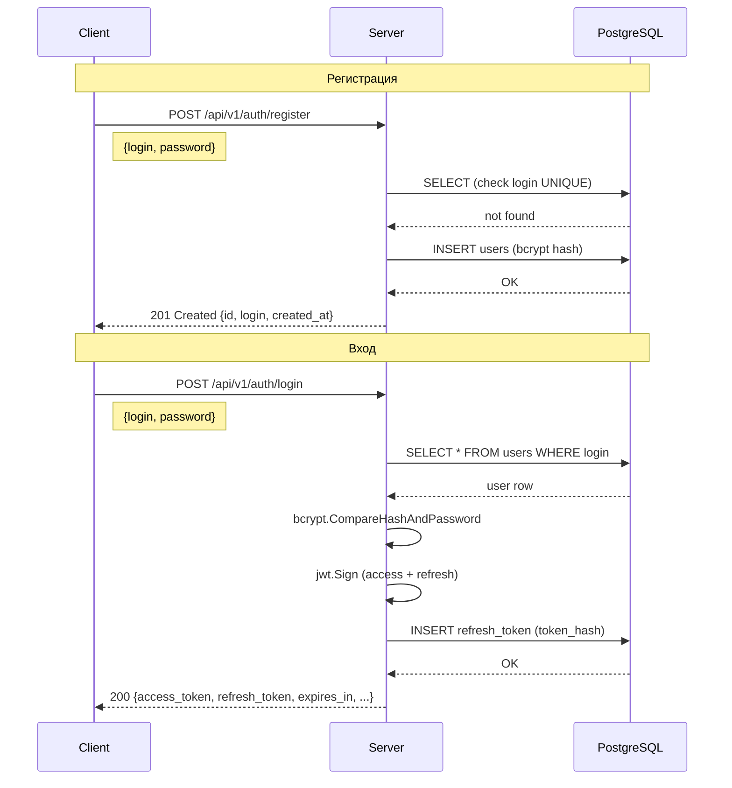
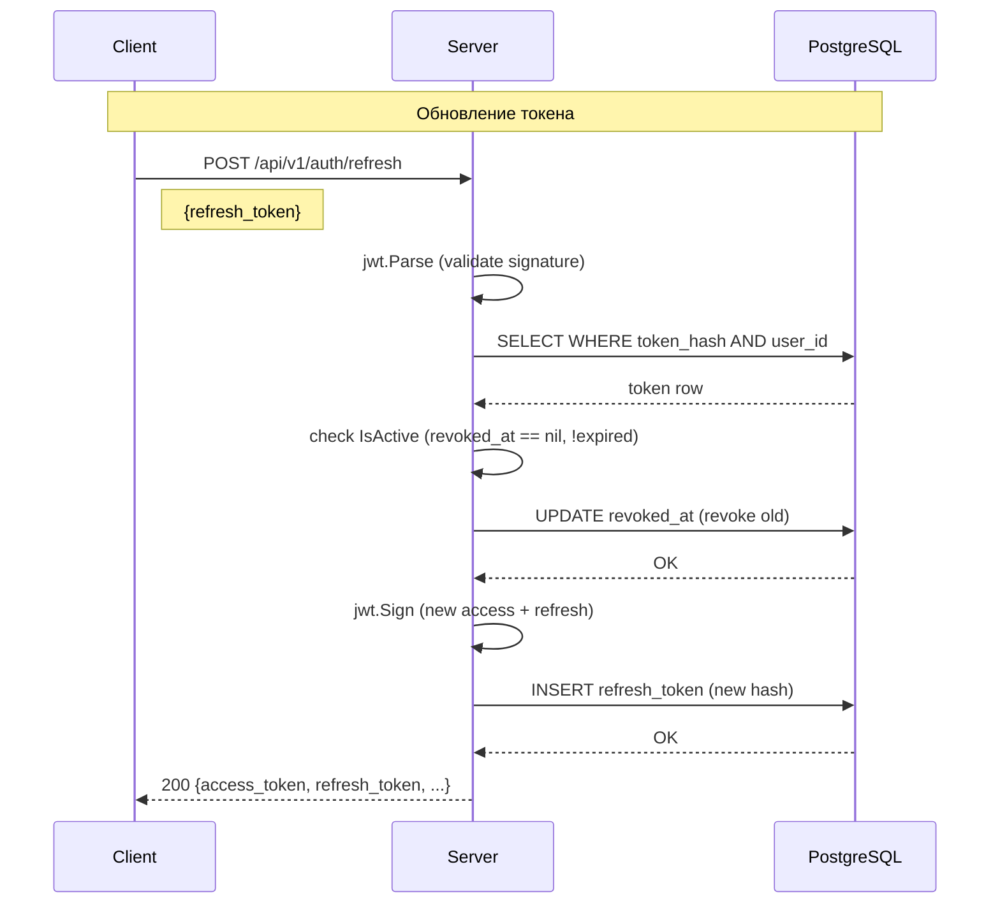
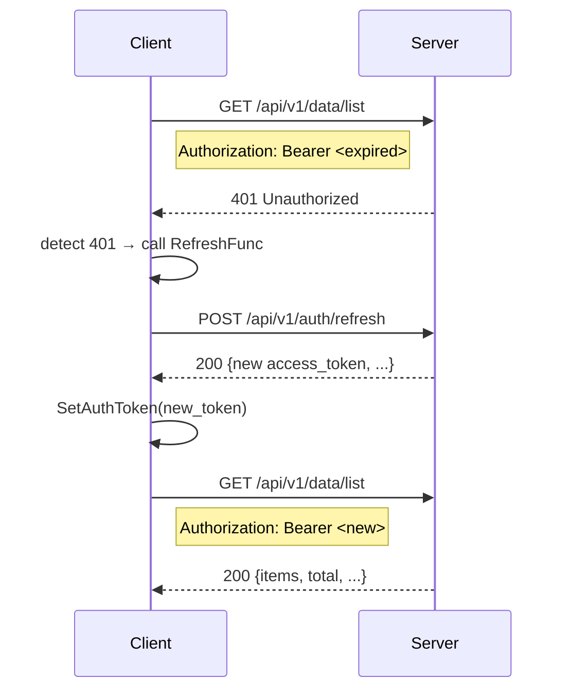
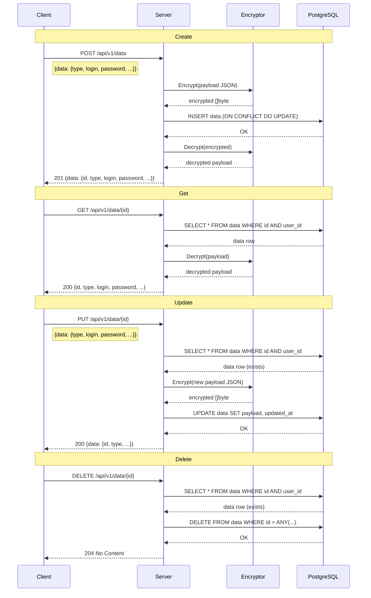
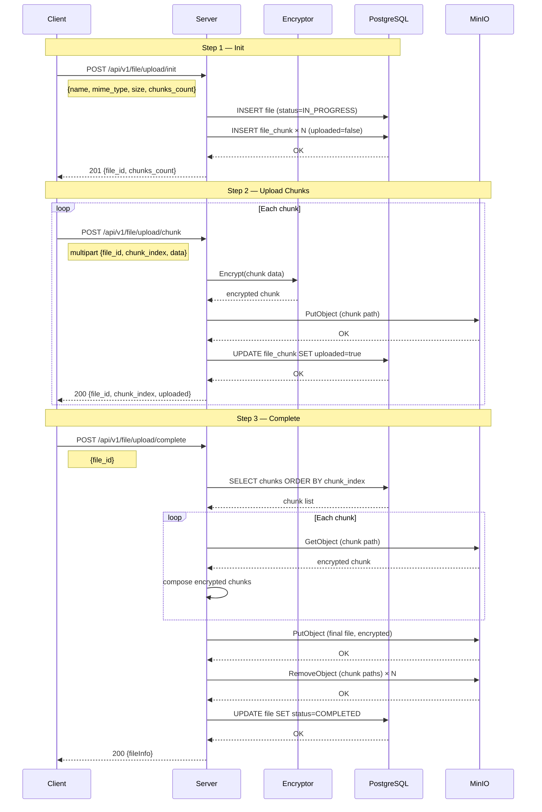
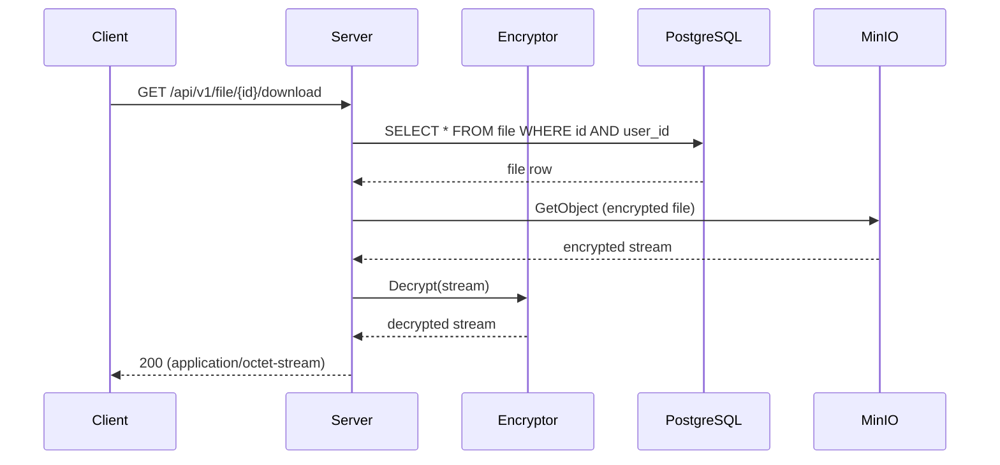
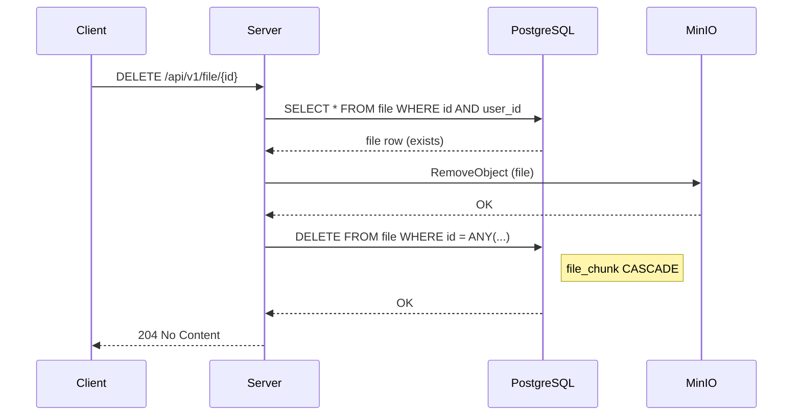

# Описание сервиса GophKeeper

## Архитектура



## Схема базы данных



### Описание таблиц

| Таблица | Описание | Ограничения |
|---------|----------|-------------|
| `users` | Пользователи | `login` — UNIQUE |
| `refresh_token` | Refresh-токены | `user_id` → `users` (CASCADE), `revoked_at` — NULL |
| `data` | Зашифрованные записи | `user_id` → `users` (CASCADE), `payload` — BYTEA (AES-GCM) |
| `file` | Метаданные файлов | `user_id` → `users` (CASCADE), `status` — IN_PROGRESS / COMPLETED / FAILED |
| `file_chunk` | Чанки файлов | `file_id` → `file` (CASCADE), UNIQUE(`file_id`, `chunk_index`) |

## API

Полная спецификация REST API: [api/swagger/openapi.yml](../api/swagger/openapi.yml)

## Sequence diagrams

### Регистрация и вход



### Refresh token



### Auto-refresh (клиент)



### Data — Create / Get / Update / Delete



### File Upload (chunked)



### File Download



### File Delete



## Типы данных

### LOGIN_PASSWORD

```json
{
  "type": "LOGIN_PASSWORD",
  "login": "user@gmail.com",
  "password": "secret123",
  "metadata": "Gmail account"
}
```

### BANK_CARD

```json
{
  "type": "BANK_CARD",
  "card_number": "**** **** **** 1234",
  "card_holder": "John Doe",
  "card_expiry": "12/25",
  "card_cvv": "123",
  "metadata": "Main debit card"
}
```

### TEXT

```json
{
  "type": "TEXT",
  "text": "Any secret text here",
  "metadata": "Secret note"
}
```

### FILE

```json
{
  "type": "FILE",
  "file_ids": ["<file-uuid-1>", "<file-uuid-2>"],
  "metadata": "Important documents"
}
```

> **Примечание:** Поле `metadata` хранится в открытом виде и используется для поиска. Все остальные поля (`login`, `password`, `card_number`, `text`, `file_ids`) шифруются AES-256-GCM и хранятся в `payload (BYTEA)`.

## Сценарии использования

### Новый пользователь

1. Пользователь получает клиент под свою платформу (Linux, macOS, Windows)
2. Инициализация клиента: `gk init --server-address http://localhost:8080`
3. Регистрация: `gk auth register --login user --password pass`
4. Вход: `gk auth login --login user --password pass`
5. Добавление данных: `gk data create --type LOGIN_PASSWORD --payload '{...}'`
6. Данные шифруются на сервере и сохраняются в PostgreSQL

### Существующий пользователь

1. Пользователь получает клиент под свою платформу
2. Инициализация клиента: `gk init --server-address http://server:8080`
3. Вход: `gk auth login --login user --password pass`
4. Токены сохраняются в SQLite на диске клиента
5. Запрос данных: `gk data list` / `gk data get --id <uuid>`
6. Данные расшифровываются сервером и передаются клиенту по HTTPS
7. При истечении access token клиент автоматически делает refresh

### Параллельные клиенты одного пользователя

- Каждый клиент хранит свои токены в локальном SQLite
- Refresh token на сервере имеет `revoked_at` — при использовании токена предыдущие токены могут быть отозваны
- Несколько клиентов могут работать одновременно, каждый с собственным refresh token
- Данные и файлы привязаны к `user_id` и доступны всем авторизованным клиентам пользователя
